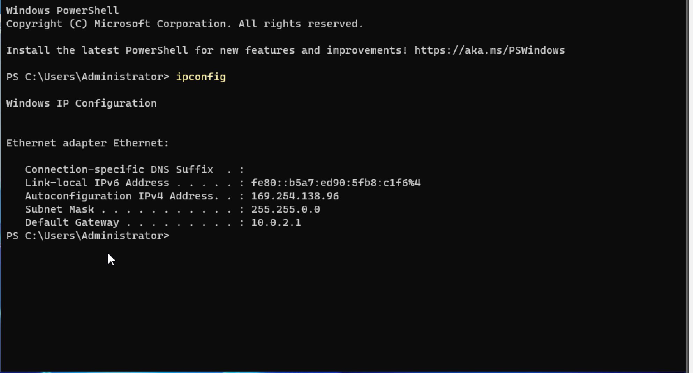
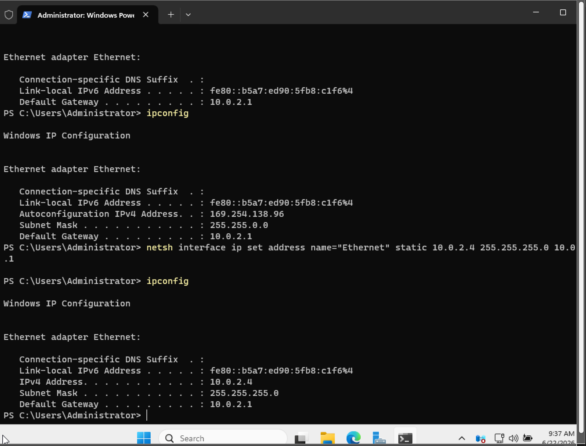
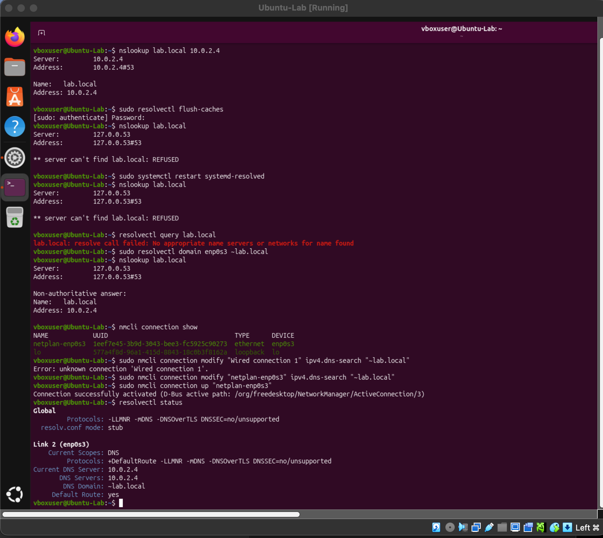
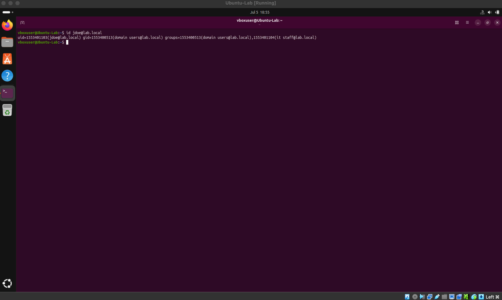

## Project 03 — Ubuntu Linux Client Joined to the Windows AD Domain

**Date:** June 22, 2026
**Goal:** Join my existing Ubuntu-Lab VM to the `lab.local` Active Directory domain (hosted on Server-Lab) so I could log in with a domain user and see AD group membership resolve on a Linux client.

### What I did
- Moved both Server-Lab (Windows Server 2025 DC) and Ubuntu-Lab from separate NAT adapters to a shared NAT Network so they could see each other.
- Gave Server-Lab a static IP (`10.0.2.4`) — standard practice for a domain controller, since AD-joined clients need to know exactly where DNS lives.
- Pointed Ubuntu-Lab's DNS at `10.0.2.4` so it would resolve `lab.local` through the DC.
- Installed the join tools on Ubuntu (`realmd`, `sssd`, `sssd-tools`, `libnss-sss`, `libpam-sss`, `adcli`, `packagekit`).
- Ran `sudo realm join lab.local -U Administrator` and confirmed with `realm list`.
- Verified end-to-end by running `id jdoe@lab.local` and seeing the domain user's UID, primary group (`domain users`), and custom group (`it staff`) come back correctly.

### Tools / environment
- **Host:** macOS (Intel)
- **Hypervisor:** Oracle VirtualBox
- **Server-Lab:** Windows Server 2025, promoted to DC for `lab.local`
- **Ubuntu-Lab:** Ubuntu 26.04 LTS
- **Networking:** VirtualBox NAT Network (shared, default name `NatNetwork`)

### Commands used
```bash
# On Server-Lab (Windows, PowerShell):
netsh interface ip set address name="Ethernet" static 10.0.2.4 255.255.255.0 10.0.2.1

# On Ubuntu-Lab:
sudo apt update
sudo apt install realmd sssd sssd-tools libnss-sss libpam-sss adcli packagekit -y
sudo realm discover lab.local
sudo realm join lab.local -U Administrator
realm list
id jdoe@lab.local

# During the DNS troubleshooting:
nslookup lab.local
sudo resolvectl flush-caches
sudo systemctl restart systemd-resolved
resolvectl query lab.local
sudo resolvectl domain enp0s3 ~lab.local
nmcli connection show
sudo nmcli connection modify "netplan-enp0s3" ipv4.dns-search "~lab.local"
sudo nmcli connection up "netplan-enp0s3"
resolvectl status
```

### What I ran into

- **Server-Lab was assigning itself a link-local `169.254.x.x` address** instead of pulling a real IP from NAT — a signal that DHCP wasn't working the way I expected in the mixed setup. `ipconfig /release` + `/renew` didn't help. Fixed by giving Server-Lab a **static IP (`10.0.2.4`)** via `netsh`, which is the correct call for a domain controller anyway.




- **The big one: `.local` DNS routing on Ubuntu.** After pointing Ubuntu-Lab's DNS at Server-Lab, `nslookup lab.local 10.0.2.4` worked fine when I named the DNS server explicitly — but plain `nslookup lab.local` came back with `** server can't find lab.local: REFUSED`. The problem was `systemd-resolved`: by default, Ubuntu treats `.local` as reserved for mDNS (link-local multicast), so it was refusing to send `lab.local` queries to a regular DNS server at all. Fixed by adding `~lab.local` as a routing domain on the interface:

```bash
sudo resolvectl domain enp0s3 ~lab.local
```

That worked immediately, but wouldn't survive a reboot. Made it permanent by editing the actual NetworkManager connection profile, which on this system is called `netplan-enp0s3` (not the generic "Wired connection 1" — good reminder to check the real connection name with `nmcli connection show` first):

```bash
sudo nmcli connection modify "netplan-enp0s3" ipv4.dns-search "~lab.local"
sudo nmcli connection up "netplan-enp0s3"
```

Verified with `resolvectl status` — Link 2 (`enp0s3`) now lists `DNS Domain: ~lab.local` on its own, no manual command needed.



- **`nmcli` didn't recognize the default connection name.** My first attempt to modify "Wired connection 1" errored with `Error: unknown connection`. Ran `nmcli connection show` to see what it was actually called (`netplan-enp0s3`) and used that instead. Small thing but a good habit — check the real name first.

### What I learned
- Domain controllers need static IPs. AD clients rely on DNS pointing to the DC, so the DC can't be a moving target.
- `systemd-resolved` is opinionated about `.local`. It treats it as mDNS-only by default, which is fine for most home networks but breaks the moment you're trying to reach a real DNS server that happens to serve a `.local` zone. The `~domain` routing syntax tells it "send queries for this domain to a normal DNS server."
- `resolvectl` sets things for the current session; `nmcli connection modify` bakes it into the profile so it survives a reboot. Both matter.
- When something in Linux networking references a "connection," the actual name isn't necessarily what you'd expect (`netplan-enp0s3` on a netplan-managed system, not "Wired connection 1"). Check first, don't assume.

### Verification
`id jdoe@lab.local` returned the domain user with correct UID and group membership, including the custom `it staff` group I'd created in AD:



That's the end-to-end proof — Ubuntu resolving a Windows AD user through Kerberos with the correct group memberships.

### Screenshots
- `server-lab-autoconfig-ip.png` — Server-Lab stuck on link-local before fix
- `server-lab-release-renew-fail.png` — `ipconfig /release`/`/renew` didn't help
- `server-lab-static-ip-10.0.2.4.png` — static IP set via `netsh`
- `ubuntu-dns-set-to-dc.png` — Ubuntu IPv4 dialog with DNS = 10.0.2.4
- `ubuntu-dns-troubleshooting-and-fix.png` — the DNS routing saga
- `ubuntu-realm-join-success.png` — `realm join` and `realm list`
- `ubuntu-id-jdoe-domain-user.png` — end-to-end proof of domain user resolution
