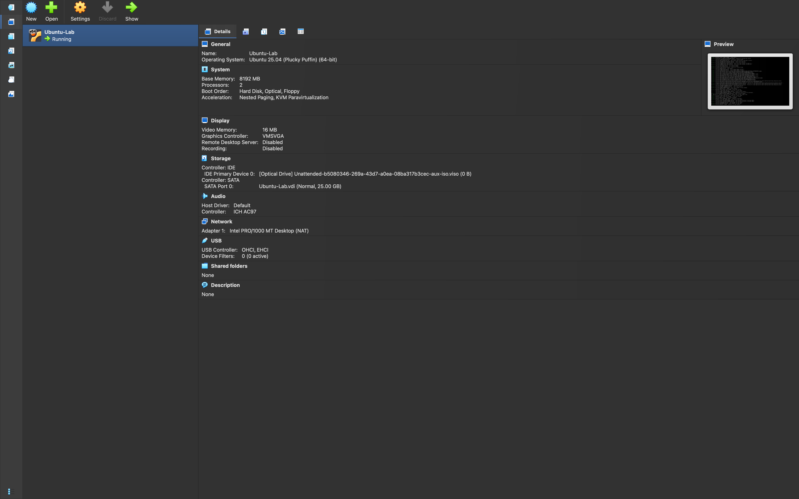
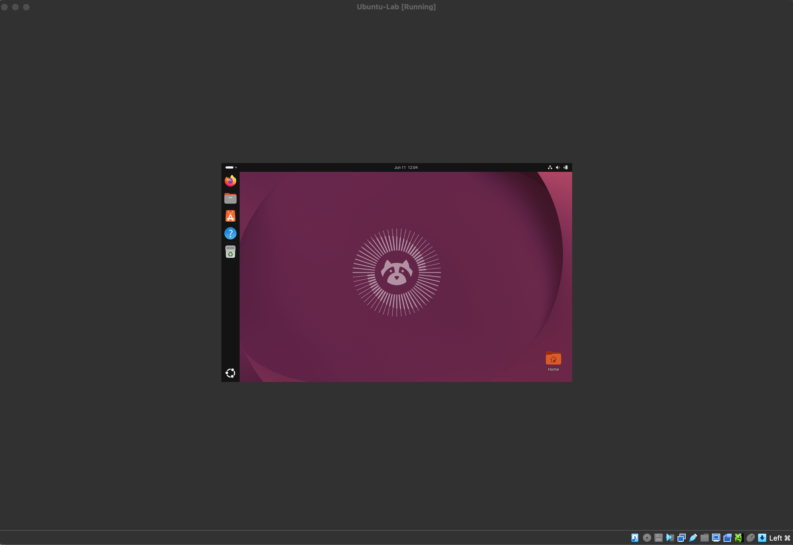
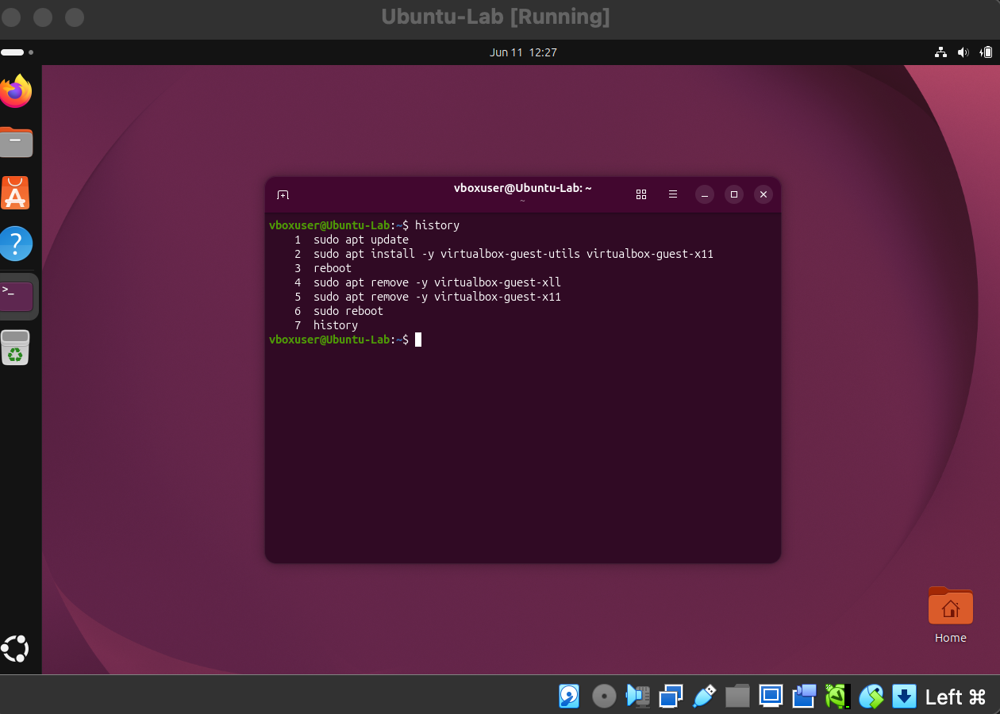

# Virtualization: VirtualBox + Ubuntu Linux VM

**Date:** June 11, 2026

**Goal:** Set up a virtualization environment and run my first virtual machine, to practice OS installation and get comfortable on the Linux command line.

### What I did
- Installed Oracle VirtualBox on an Intel Mac.
- Created a new VM (2 CPUs, 8192 MB (8 GB) RAM, 25 GB dynamic virtual disk).
- Installed Ubuntu 26.04 LTS from the downloaded ISO.
- Booted into the desktop and ran my first terminal commands.

### Tools / environment
- **Host:** macOS (Intel)
- **Hypervisor:** Oracle VirtualBox 7.2.8
- **Guest OS:** Ubuntu 26.04 LTS

### Commands used along the way
```bash
whoami        # confirm the logged-in user
ls            # list directory contents
pwd           # print working directory (where am I in the filesystem)
sudo apt update            # refresh the package catalog (run as admin via sudo)
passwd                     # change my account password
apt list --installed | grep virtualbox-guest-x11   # pipe output into grep to check if a package is installed
timedatectl set-timezone America/Chicago           # set the system timezone
```

### What I ran into
- **Small VM window stuck at low resolution.** The guest OS launched at a low default resolution and wouldn't fill the screen even in full-screen mode, because the proper display drivers weren't installed yet. I installed VirtualBox Guest Additions (`virtualbox-guest-utils` and `virtualbox-guest-x11`) to fix this and set virtual screen to scale to 200%.
- **VM froze at the login screen after the Guest Additions reboot.** After installing Guest Additions and rebooting, the VM hung on the login screen and wouldn't respond. Resolved by powering the VM off and restarting it from VirtualBox; on the next boot it reached the login screen normally.
- **System clock showing the wrong time.** Noticed the VM's clock was off because the timezone wasn't set during install. Corrected it from the terminal with `timedatectl set-timezone America/Chicago` (Central time), and the clock updated to the correct local time.

### What I learned
- What a hypervisor does and how a VM isolates a guest OS from the host.
- The difference between an ISO image and an installed system.
- Basic terminal navigation (`whoami`, `ls`, `pwd`) and what `sudo` does.
- The difference between `apt update` (refresh the catalog), `apt upgrade` (install newer versions), and `apt install [name]` (install a specific package).
- Changing a user password from the command line with `passwd`
- Using a pipe (`|`) to feed one command's output into `grep` to search it — and that an empty result can be confirmation

### Screenshots
VirtualBox with the Ubuntu VM



Ubuntu desktop running



First terminal commands


