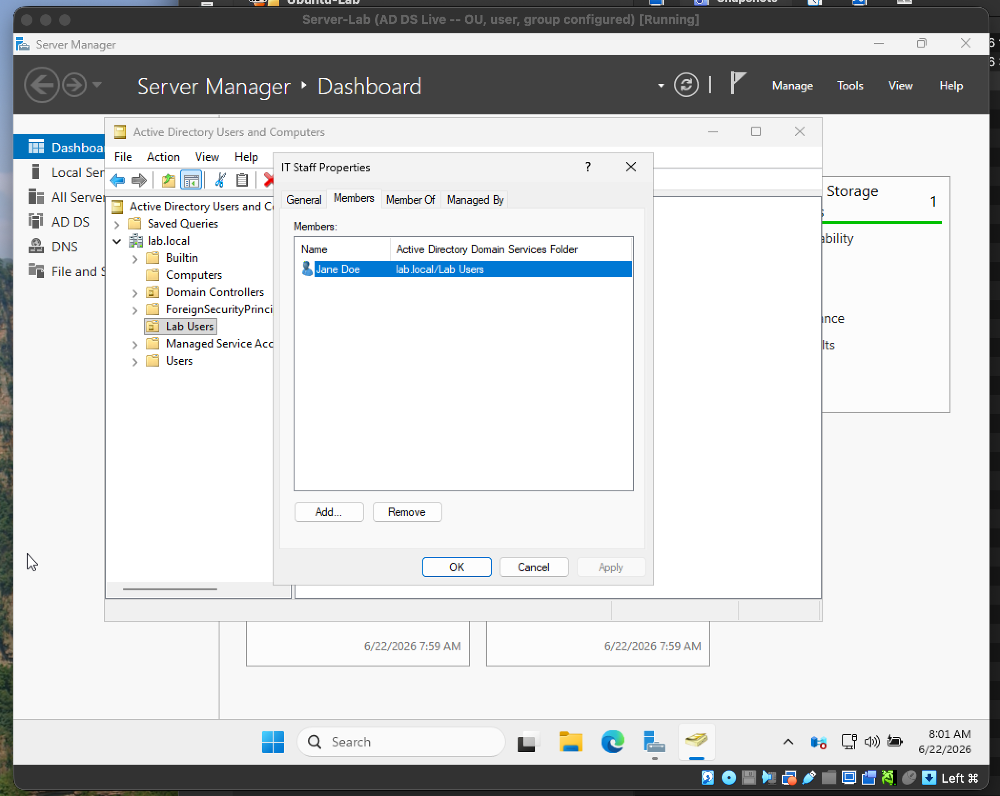
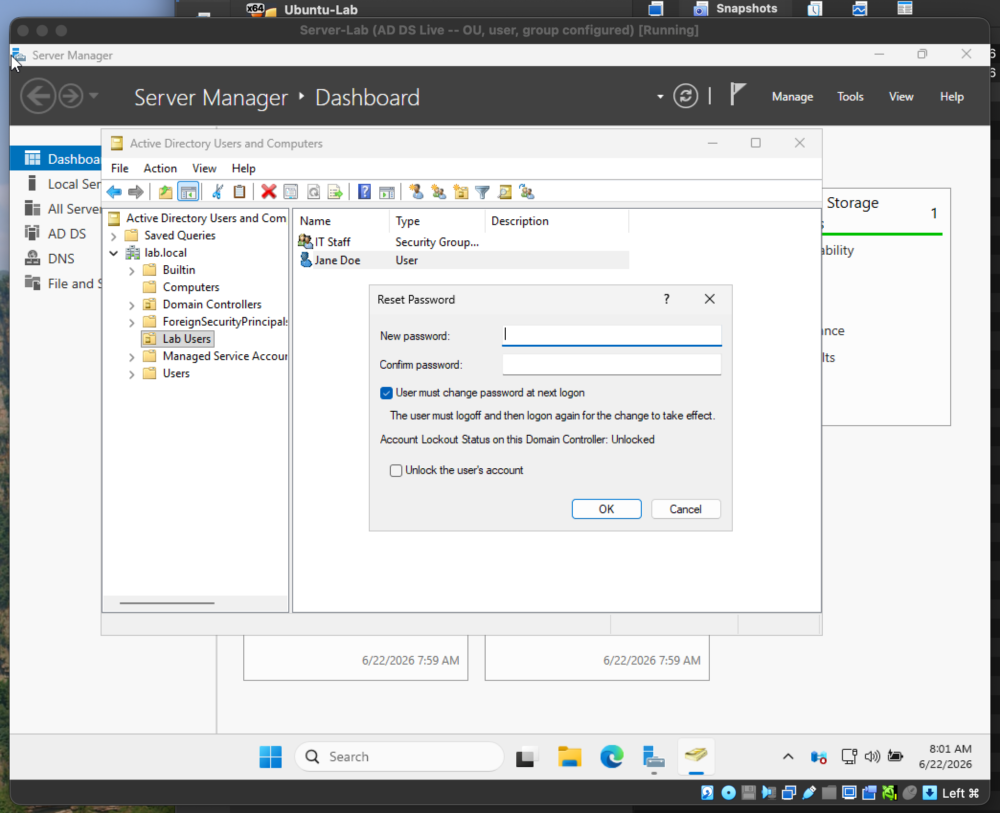

# Windows Server 2025 & Active Directory

**Date:** June 21, 2026

**Goal:** Build a Windows Server domain controller and practice core Active Directory admin tasks — creating an OU, a user, a group, and resetting a password.

### What I did
- Installed Windows Server 2025 (Standard, Desktop Experience) in VirtualBox.
- Installed the Active Directory Domain Services role and promoted the server to a domain controller, creating a new forest/domain (`lab.local`).
- Created an Organizational Unit, a user account, and a security group in Active Directory Users and Computers, and added the user to the group.
- Practiced resetting a user's password.
- Took VM snapshots before the role install and before the domain promotion, so either step had a one-click rollback.

### Tools / environment
- **Host:** macOS (Intel)
- **Hypervisor:** Oracle VirtualBox 7.2.8
- **Guest OS:** Windows Server 2025 Standard (Desktop Experience)
- VM specs: 4096 MB RAM, 2 CPUs, 60 GB dynamic virtual disk

### What I ran into
- **Routine resizing issue — guest screen too small.** Installed Guest Additions and scaled the virtual screen to 200%.
- **Mouse would move but clicks stopped registering inside the Server VM.** Graphics Controller had ended up set to VBoxSVGA instead of VMSVGA. Switching it to VMSVGA fixed it; not sure how it got set to VBoxSVGA in the first place.

### What I learned
- How to install a Windows Server role and promote a server to a domain controller.
- The basic AD structure: Organizational Units, users, security groups, and how group membership works.
- How to reset user passwords.
- Taking a snapshot before a big config change (role install, domain promotion) is a safe habit.

### Screenshots
Group membership in ADUC

Password reset

